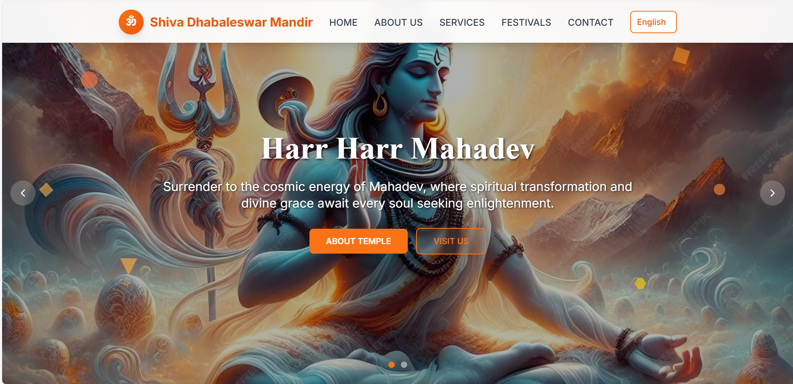
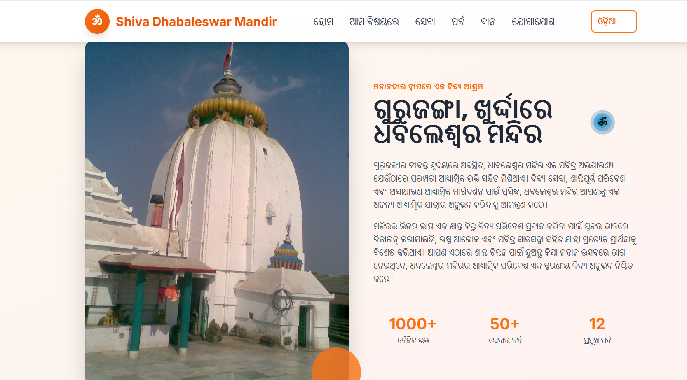
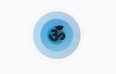
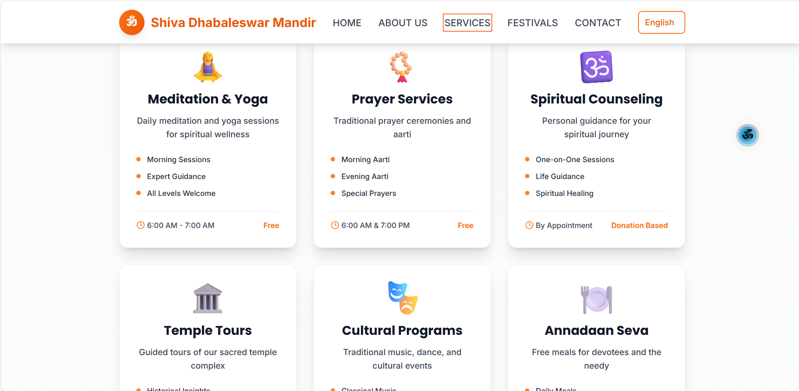
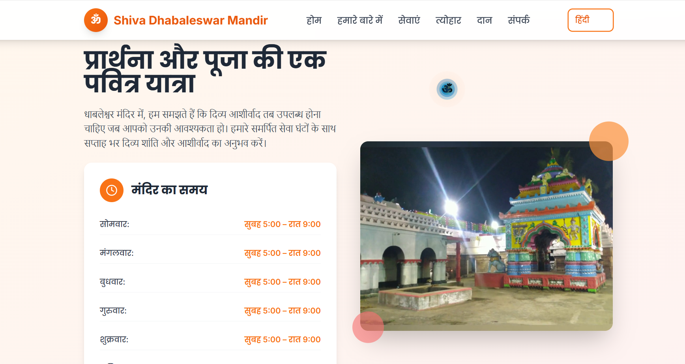
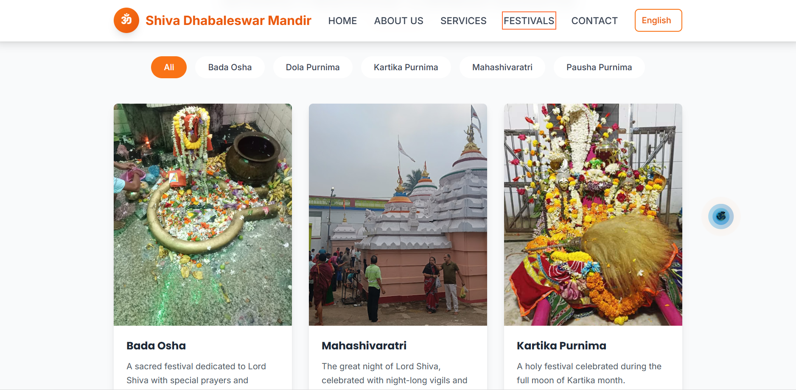

<h1 align="center">🛕 Dhabaleswar Temple Website</h1>

  
  
  

  🌐 <a href="https://github.com/subhasmita-puja/Dhabaleswar-Temple" target="_blank"><strong>Repository</strong></a> • ⭐ <a href="https://github.com/subhasmita-puja/Dhabaleswar-Temple/stargazers">Give a Star</a>

---

## 🌟 About the Project

The **Dhabaleswar Temple Website** is a 3D animated spiritual web experience built using **React**, **Three.js**, and **Tailwind CSS**.  
It features **multi-language support** (Odia, English, and Hindi) and an elegant **ॐ mouse follower effect**, bringing divine motion and interactivity together.

> “A digital tribute to Lord Shiva’s sacred Dhabaleswar Temple — where tradition meets technology.”

---

## 🧠 Features

- 🌍 **Multi-language Support** — Odia | English | Hindi  
- 🕉️ **Custom ॐ Mouse Follower**  
- 🌀 **3D Animated UI** using Three.js  
- 💨 **Fast and Lightweight** build with Vite  
- 🎨 **Responsive Design** — works on all devices  
- 🔊 **Immersive Experience** with smooth scroll and effects

---

## 🚀 Tech Stack

| Technology | Description |
|-------------|-------------|
| ⚛️ React | Component-based UI framework |
| ⚡ Vite | Fast development build tool |
| 🎥 Three.js | 3D rendering and animation |
| 🎨 Tailwind CSS | Modern, utility-first styling |
| 🌐 i18n | Multi-language integration |

---

## 🖼️ Screenshots

| Home Page | About Page | ॐ Mouse Follower |
|------------|-------------------|------------------|
|  |  |  |

---
| Services Page | Language Selector | Festival Page |
|------------|-------------------|------------------|
|  |  |  |

---

## 💡 What I Learned

- Implementing **Three.js animations** in React  
- Integrating **multi-language translation** using i18n  
- Designing **custom cursor effects** (ॐ symbol)  
- Creating **responsive, animated spiritual UI** with Tailwind CSS

---

## 🙋‍♀️ About the Developer

**Subhasmita Sahoo**  
Frontend Developer | MERN Stack | 3D Web Enthusiast  

📍 Khordha, Odisha  
📧 [subhasmita4602@gmail.com](mailto:subhasmita4602@gmail.com)  
🔗 [GitHub](https://github.com/subhasmita-puja) • [LinkedIn](https://www.linkedin.com/in/subhasmita-sahoo-puja)

---

## 🌟 Show Your Support

If you like this project, please ⭐ **star the repository** and share your feedback!

---

## 🪷 License

This project is licensed under the **MIT License**.
